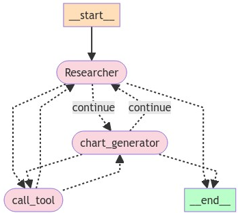
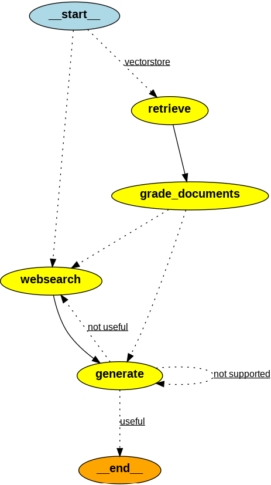

# AgenticRAG Exploration and Testing

This repository contains Jupyter Notebook (`.ipynb`) files and Python (`.py`) scripts for exploring, learning, and testing **AgenticRAG** using the following libraries:

- **Langchain**
- **Chroma** for vector store embeddings
- **Langchain** for embedding creation
- **Tavily** for web search functionality

## LangGraph Workflow

### 1. LLM Router
- Implement the LLM router to direct requests to appropriate language models based on input criteria.

### 2. Generation Chain
- Create a chain for generating responses using the chosen LLM.

### 3. Retrieval Grader
- Implement the retrieval grader to evaluate the quality and relevance of retrieved information.

### 4. Hallucination Grader
- Develop a grader that assesses the likelihood of hallucinations in the generated outputs.

### 5. Answer Grader
- Create an answer grader to evaluate the correctness and usefulness of the final answers provided.

### 6. Web Search Tool (Tavily)
- Integrate the Tavily web search tool to enhance the capability of the LLM by retrieving information from the web.


## Required API Keys

To use this project, you will need the following API keys:

- **OpenAI API Key**: Required for accessing OpenAI's language models.
- **Tavily API Key**: Needed for the web search functionality.
- **Langchain API Key**: Required for using Langchain features.

Make sure to set these API keys as environment variables in your development environment:

```bash
export OPENAI_API_KEY='your_openai_api_key'
export TAVILY_API_KEY='your_tavily_api_key'
export LANGCHAIN_API_KEY='your_langchain_api_key'
```
## Graph Result


#### Usage
Clone the repository:
```
git clone https://github.com/wissalBayoudh/LLMRAG.git
```
###### Installation

To install the required libraries, run:

```bash
pip install -r requirements.txt
```

